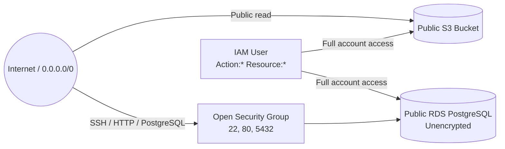
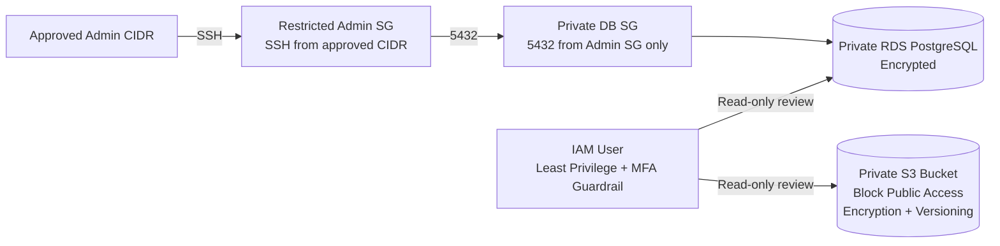

# AWS Lab Architecture

## Vulnerable state

```mermaid
flowchart LR
    Internet((Internet / 0.0.0.0/0))
    S3[(Public S3 Bucket)]
    SG[Open Security Group\n22, 80, 5432]
    RDS[(Public RDS PostgreSQL\nUnencrypted)]
    IAM[IAM User\nAction:* Resource:*]

    Internet -->|Public read| S3
    Internet -->|SSH / HTTP / PostgreSQL| SG
    SG --> RDS
    IAM -->|Full account access| S3
    IAM -->|Full account access| RDS
```

## Remediated state

```mermaid
flowchart LR
    Admin[Approved Admin CIDR]
    S3[(Private S3 Bucket\nBlock Public Access\nEncryption + Versioning)]
    AdminSG[Restricted Admin SG\nSSH from approved CIDR]
    DBSG[Private DB SG\n5432 from Admin SG only]
    RDS[(Private RDS PostgreSQL\nEncrypted)]
    IAM[IAM User\nLeast Privilege + MFA Guardrail]

    Admin -->|SSH| AdminSG
    AdminSG -->|5432| DBSG
    DBSG --> RDS
    IAM -->|Read-only review| S3
    IAM -->|Read-only review| RDS
```
