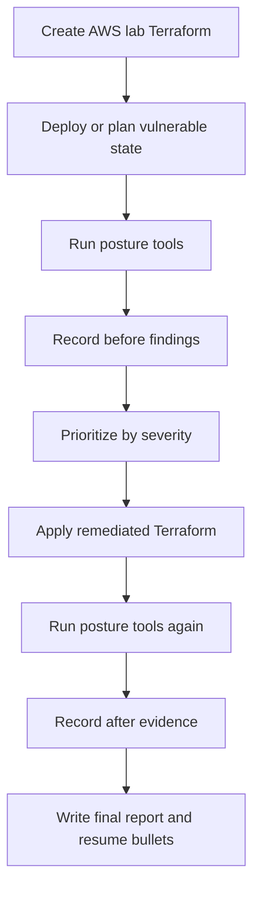

# Security Review Workflow

```mermaid
flowchart TD
    A[Create AWS lab Terraform] --> B[Deploy or plan vulnerable state]
    B --> C[Run posture tools]
    C --> D[Record before findings]
    D --> E[Prioritize by severity]
    E --> F[Apply remediated Terraform]
    F --> G[Run posture tools again]
    G --> H[Record after evidence]
    H --> I[Write final report and resume bullets]
```
